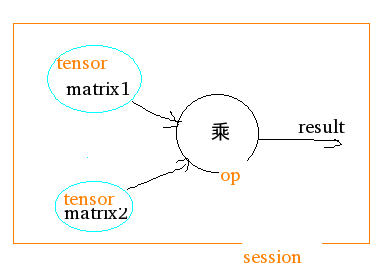

## 基础使用
TensorFlow几个要点
１、使用图graph来代表计算
２、在Sessions环境中执行图
３、使用tensors代表数据
４、使用Variables变量维护状态
５、使用feeds和fetches获取或写入操作

## 图的使用
构建下图

### 构建图
```
import tensorflow as tf
# 声明常量
matrix1 = tf.constant([[3., 3.]])
matrix2 = tf.constant([[2.],[2.]])
# 声明操作
product = tf.matmul(matrix1, matrix2)
```
### 启动图
```
# 启动默认图
sess = tf.Session()
# 在图中执行　操作
result = sess.run(product)
print(result)
# ==> [[ 12.]]
# 关闭图
sess.close()
```
Sessions自动释放资源
```
with tf.Session() as sess:
  result = sess.run([product])
  print(result)
```
##　在Python解释器中使用
在解释器中可以使用InteractiveSession class, Tensor.eval() ，Operation.run()，避免使用变量保存session
```
# Enter an interactive TensorFlow Session.
import tensorflow as tf
sess = tf.InteractiveSession()

x = tf.Variable([1.0, 2.0])
a = tf.constant([3.0, 3.0])

# Initialize 'x' using the run() method of its initializer op.
x.initializer.run()

# Add an op to subtract 'a' from 'x'.  Run it and print the result
sub = tf.sub(x, a)
print(sub.eval())
# ==> [-2. -1.]

# Close the Session when we're done.
sess.close()
```

## Tensors
TensorFlow使用tensor数据结构表示所有数据，在不同操作之间只能传入tensor数据。tensor类似Ｎ维数组，一个tensor包括一个数据类型，一个rank(阶，张量的维数)和一个shape（形状，张量的维度）
| 阶 | 形状 | 维数 | 实例 |
|:--------|:---------|:-------|:-------|
| 0 | [] | 0-D | 纯量 s = 483 |
| 1 | [D0] | 1-D | 向量 v = [1.1, 2.2, 3.3] |
| 2 | [D0,D1] | 2-D | 矩阵 m = [[1, 2, 3], [4, 5, 6], [7, 8, 9]] |
| 3 | [D0,D1,D2] | 3-D | 3阶张量 t = [[[2], [4], [6]], [[8], [10], [12]], [[14], [16], [18]]] |
| n | [D0,...Dn] | 4-D | n阶 |

## 变量
变量存储图的状态
```
import tensorflow as tf
# 创建变量state,并初始化为０
state = tf.Variable(0, name="counter")
# 创建常量one,值为１
one = tf.constant(1)
# 加操作
new_value = tf.add(state, one)
# 赋值 new_value给state
update = tf.assign(state, new_value)
# 初始化所有变量
init_op = tf.global_variables_initializer()
# 启动图，执行操作
with tf.Session() as sess:
  # 执行init_op操作
  sess.run(init_op)
  # 打印state初始值
  print(sess.run(state))
  # 执行更新state的操作，并打印
  for _ in range(3):
    sess.run(update)
    print(sess.run(state))

# output:

# 0
# 1
# 2
# 3
```
sess.run(init_op)之前并没有执行任何操作，所以state为０。sess.run(update)执行操作才会更新state值。

## Fetches
用于取出操作的结果。尽量在一次操作运行中取出多个tensor，提高效率。
｀｀｀
import tensorflow as tf

input1 = tf.constant([3.0])
input2 = tf.constant([2.0])
input3 = tf.constant([5.0])
# 加
intermed = tf.add(input2, input3)
# 乘
mul = tf.multiply(input1, intermed)
# (input2 + input3) * input1
with tf.Session() as sess:
  result = sess.run([mul, intermed])
  print(result)

# output:
# [array([ 21.], dtype=float32), array([ 7.], dtype=float32)]
｀｀｀
## Feeds
用于临时保存tensor值，调用方法结束后，feed消失
```
import tensorflow as tf

input1 = tf.placeholder(tf.float32)
input2 = tf.placeholder(tf.float32)
# 乘
output = tf.multiply(input1, input2)

with tf.Session() as sess:
  print(sess.run([output], feed_dict={input1:[7.], input2:[2.]}))

# 输出:
# [array([ 14.], dtype=float32)]
```
