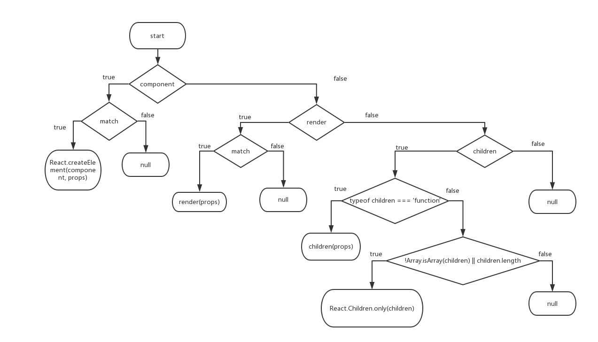

版本是master

## 示例
```
import React from 'react'
import {
  BrowserRouter as Router,
  Route,
  Link
} from 'react-router-dom'

const Home = () => (
  <div>
    <h2>Home</h2>
  </div>
)

const About = () => (
  <div>
    <h2>About</h2>
  </div>
)

const AboutAuthor = () => (
  <div>
    <h2>AboutAuthor</h2>
  </div>
)

const AboutTopic = () => (
  <div>
    <h2>AboutTopic</h2>
  </div>
)

const Topic = ({ match }) => (
  <div>
    <h3>{match.params.topicId}</h3>
  </div>
)

const Topics = ({ match }) => (
  <div>
    <h2>Topics</h2>
    <ul>
      <li>
        <Link to={`${match.url}/rendering`}>
          Rendering with React
        </Link>
      </li>
      <li>
        <Link to={`${match.url}/components`}>
          Components
        </Link>
      </li>
      <li>
        <Link to={`${match.url}/props-v-state`}>
          Props v. State
        </Link>
      </li>
    </ul>

    <Route path={`${match.url}/:topicId`} component={Topic}/>
    <Route exact path={match.url} render={() => (
      <h3>Please select a topic.</h3>
    )}/>
  </div>
)

const BasicExample = () => (
  <Router>
    <div>
      <ul>
        <li><Link to="/">Home</Link></li>
        <li><Link to="/about">About</Link></li>
        <li><Link to="/topics">Topics</Link></li>
      </ul>

      <hr/>

      <Route exact path="/" component={Home}/>
      <Route path="/about" component={About}/>
      <Route path="/topics" component={Topics}/>
    </div>
  </Router>
)
export default BasicExample
```
Router本身是一个react组件，这点也可以从源码中看出来

## 源码

### Router Component
history用于取location，
state的match存储了一个有关当前pathname的对象，Router的children是Route，用于存储要渲染的Component，判断该Component是否渲染是在Route内判断的
```
import warning from 'warning'
import invariant from 'invariant'
import React from 'react'
import PropTypes from 'prop-types'

/**
 * The public API for putting history on context.
 */
class Router extends React.Component {
  static propTypes = {
    history: PropTypes.object.isRequired,
    children: PropTypes.node
  }

  static contextTypes = {
    router: PropTypes.object
  }

  static childContextTypes = {
    router: PropTypes.object.isRequired
  }

  getChildContext() {
    return {
      router: {
        ...this.context.router,
        history: this.props.history,
        route: {
          location: this.props.history.location,
          match: this.state.match
        }
      }
    }
  }

  state = {
    match: this.computeMatch(this.props.history.location.pathname)
  }

  computeMatch(pathname) {
    return {
      path: '/',
      url: '/',
      params: {},
      isExact: pathname === '/'
    }
  }

  componentWillMount() {
    const { children, history } = this.props

    invariant(
      children == null || React.Children.count(children) === 1,
      'A <Router> may have only one child element'
    )

    // Do this here so we can setState when a <Redirect> changes the
    // location in componentWillMount. This happens e.g. when doing
    // server rendering using a <StaticRouter>.
    this.unlisten = history.listen(() => {
      this.setState({
        match: this.computeMatch(history.location.pathname)
      })
    })
  }

  componentWillReceiveProps(nextProps) {
    warning(
      this.props.history === nextProps.history,
      'You cannot change <Router history>'
    )
  }

  componentWillUnmount() {
    this.unlisten()
  }

  render() {
    const { children } = this.props
    return children ? React.Children.only(children) : null
  }
}

export default Router
```

### Route Component
Route用于匹配一个路径并渲染Component


```
import warning from 'warning'
import React from 'react'
import PropTypes from 'prop-types'
import matchPath from './matchPath'

/**
 * The public API for matching a single path and rendering.
 */
class Route extends React.Component {
  static propTypes = {
    computedMatch: PropTypes.object, // private, from <Switch>
    path: PropTypes.string,
    exact: PropTypes.bool,
    strict: PropTypes.bool,
    component: PropTypes.func,
    render: PropTypes.func,
    children: PropTypes.oneOfType([
      PropTypes.func,
      PropTypes.node
    ]),
    location: PropTypes.object
  }

  static contextTypes = {
    router: PropTypes.shape({
      history: PropTypes.object.isRequired,
      route: PropTypes.object.isRequired,
      staticContext: PropTypes.object
    })
  }

  static childContextTypes = {
    router: PropTypes.object.isRequired
  }

  getChildContext() {
    return {
      router: {
        ...this.context.router,
        route: {
          location: this.props.location || this.context.router.route.location,
          match: this.state.match
        }
      }
    }
  }

  state = {
    match: this.computeMatch(this.props, this.context.router)
  }

  computeMatch({ computedMatch, location, path, strict, exact }, { route }) {
    if (computedMatch)
      return computedMatch // <Switch> already computed the match for us

    const pathname = (location || route.location).pathname

    return path ? matchPath(pathname, { path, strict, exact }) : route.match
  }

  componentWillMount() {
    const { component, render, children } = this.props

    warning(
      !(component && render),
      'You should not use <Route component> and <Route render> in the same route; <Route render> will be ignored'
    )

    warning(
      !(component && children),
      'You should not use <Route component> and <Route children> in the same route; <Route children> will be ignored'
    )

    warning(
      !(render && children),
      'You should not use <Route render> and <Route children> in the same route; <Route children> will be ignored'
    )
  }

  componentWillReceiveProps(nextProps, nextContext) {
    warning(
      !(nextProps.location && !this.props.location),
      '<Route> elements should not change from uncontrolled to controlled (or vice versa). You initially used no "location" prop and then provided one on a subsequent render.'
    )

    warning(
      !(!nextProps.location && this.props.location),
      '<Route> elements should not change from controlled to uncontrolled (or vice versa). You provided a "location" prop initially but omitted it on a subsequent render.'
    )

    this.setState({
      match: this.computeMatch(nextProps, nextContext.router)
    })
  }

  render() {
    const { match } = this.state
    const { children, component, render } = this.props
    const { history, route, staticContext } = this.context.router
    const location = this.props.location || route.location
    const props = { match, location, history, staticContext }

    return (
      component ? ( // 先判断Route是否有component props
        // 判断是否匹配
        match ? React.createElement(component, props) : null
      ) : render ? ( // render prop is next, only called if there's a match
        match ? render(props) : null
      ) : children ? ( // children come last, always called
        typeof children === 'function' ? (
          children(props)
        ) : !Array.isArray(children) || children.length ? ( // Preact defaults to empty children array
          React.Children.only(children)
        ) : (
          null
        )
      ) : (
        null
      )
    )
  }
}

export default Route
```
### matchPath匹配路径
1、path-to-regexp把路径path转换成正则对象，并存储
2、正则匹配
```
import pathToRegexp from 'path-to-regexp'
// var re = pathToRegexp('/foo/:bar', keys)
// re = /^\/foo\/([^\/]+?)\/?$/i
const patternCache = {}
const cacheLimit = 10000
let cacheCount = 0

const compilePath = (pattern, options) => {
  const cacheKey = `${options.end}${options.strict}`
  const cache = patternCache[cacheKey] || (patternCache[cacheKey] = {})

  if (cache[pattern])
    return cache[pattern]

  const keys = []
  const re = pathToRegexp(pattern, keys, options)
  const compiledPattern = { re, keys }

  if (cacheCount < cacheLimit) {
    cache[pattern] = compiledPattern
    cacheCount++
  }

  return compiledPattern
}

/**
 * Public API for matching a URL pathname to a path pattern.
 */
const matchPath = (pathname, options = {}) => {
  if (typeof options === 'string')
    options = { path: options }

  const { path = '/', exact = false, strict = false } = options
  const { re, keys } = compilePath(path, { end: exact, strict })
  // 匹配路径
  const match = re.exec(pathname)

  if (!match)
    return null

  const [ url, ...values ] = match
  const isExact = pathname === url

  if (exact && !isExact)
    return null

  return {
    path, // the path pattern used to match
    url: path === '/' && url === '' ? '/' : url, // the matched portion of the URL
    isExact, // whether or not we matched exactly
    params: keys.reduce((memo, key, index) => {
      memo[key.name] = values[index]
      return memo
    }, {})
  }
}

export default matchPath
```
### 其它
Prompt：用于页面跳转时的提示
Redirect：在组件内跳转location
StaticRouter：用于服务器端渲染
