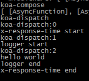

## koa对象
1 http服务创建
2 中间件的添加
3 为中间件传入请求，响应参数
4 中间件的执行
```
const Emitter = require('events');
const http = require('http');

module.exports = class Application extends Emitter {
    constructor() {
    super();

    this.middleware = [];
  }

  // 创建http服务，监听端口
  listen() {
    const server = http.createServer(this.callback());
    return server.listen.apply(server, arguments);
  }
  // 接收到http请求，触发的回调函数
  callback() {
    console.log('http callback')
    console.log(this)
    const fn = this.compose(this.middleware);

    const handleRequest = (request, response) => {
      // 把http请求，响应放进context传入中间件
      const context = Object.create(null, {
        request: {value: request},
        response: {value: response},
      })
      return fn(context).catch((err) => {
        console.log('err')
        console.log(err)
      });
    };

    return handleRequest;
  }
  // 添加中间件
  use(fn) {
    this.middleware.push(fn);
    return this;
  }
  // 执行所有中间件
  compose(middleware) {
    console.log('compose')
    console.log(middleware)
    return function(context, next) {
      console.log('dispatch')
      let index = -1
      return dispatch(0)
      function dispatch(i) {
        console.log('dispatch:' + i)
        index = i
        let fn = middleware[i]
        if (i === middleware.length) fn = next
        if (!fn) return Promise.resolve()
        try {
        return Promise.resolve(fn(context, function next () {
          return dispatch(i + 1)
        }))
      } catch (err) {
        return Promise.reject(err)
      }
      }
    }
  }
}


```
## 例子

```
const Koa = require('./application')
const app = new Koa()

// x-response-time

app.use(async function (context, next) {
  console.log('x-response-time start')
  console.log(context)
  const start = new Date()
  await next()
  const ms = new Date() - start
  console.log('x-response-time end')
})

// logger

app.use(async function (context, next) {
  console.log('logger start')
  const start = new Date()
  await next()
  const ms = new Date() - start
  console.log('logger end')
})

// response

app.use(context => {
  // 可以使用原生的方法处理请求，响应
  console.log('hello world')
  context.response.stateCode = '200'
  context.response.end('Hello World')
})

app.listen(3001)

```
### 最终输出log
koa-dispatch 中间件执行发起

