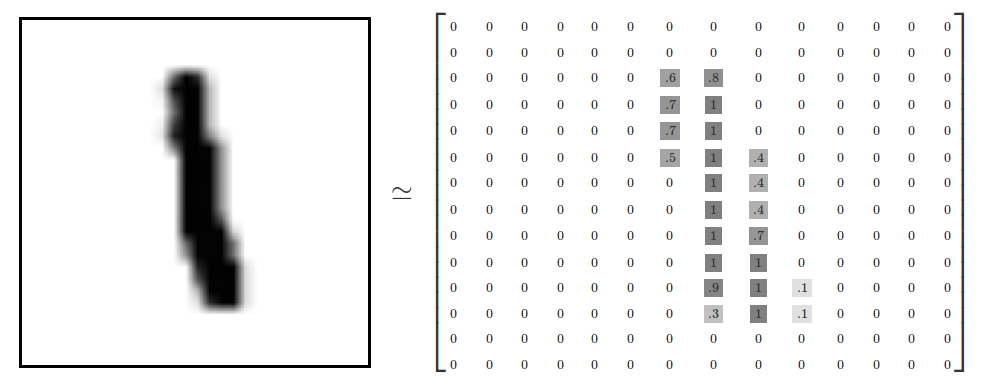
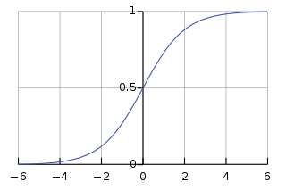

## MNIST数据集
数据集中每个数据单元由一张图片和一个对应标签组成。图片包含28*28个像素点

每个像素点的值介于0-1之间，
## Softmax回归
Softmax回归是Logistic回归的推广，Logistic回归用于处理二分类问题，Softmax回归可以处理多分类问题。
Logistic函数(或称为Sigmoid函数)


g(z) = \frac{1}{1 + e^{-z}}



线性函数


\theta _{0} + \theta _{1}x_{1} + ... + \theta _{n}x_{n} = \sum_{i=0}^{n} \theta _{i}x_{i} = \theta ^{T}x


代入g(z)


h _{\theta}(x) = g(\theta ^{T}x) = \frac{1}{1 + e ^{-\theta ^{T}x}}


可推导


P(y=1|x;\theta) = h _{\theta}(x)




P(y=0|x;\theta) = 1 - h _{\theta}(x)



使用最大似然估计进行参数估计，假设所有样本独立同分布，


P(y|x;\theta) = (h _{\theta}(x)) ^{y} (1 - h _{\theta}(x)) ^ {1-y}


似然函数


L(\theta) = \prod_{i=1}^{m}P(y ^{(i)} | x^{(i)}; \theta) = \prod_{i=1}^{m} (h _{\theta}(x ^{(i)})) ^{y ^{(i)}} (1 - h_{\theta}(x ^{(i)})) ^{1 - y ^{(i)}}


对数似然函数


l(\theta) = log L(\theta) = \sum_{i=1}^{m} ( (y^{(i)})log(h_{\theta}(x^{(i)})) + (1-y^{(i)})log(1-h_{\theta}(x^{(i)})))


最大似然估计是求l(\theta)取最大值时的θ。可以使用梯度下降法求。
图片分类需要识别0-9，使用Softmax回归取得每个数字的概率。


p(y=0|x) = \frac{1}{1 + e^{(w^{T}x+b)}}


