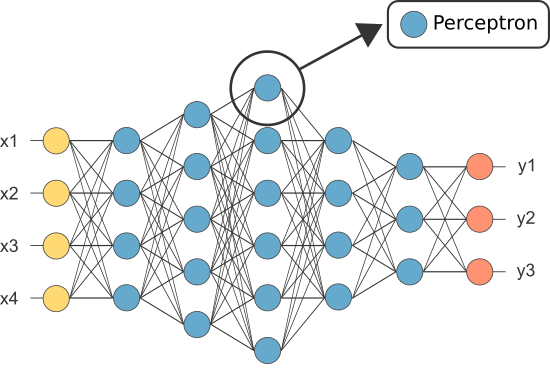

DNN，Deep Neural Networks，深度神经网络
对于人工智能的实现分为两派：一派是自顶向下通过逻辑和符号推导实现，另一类是自底向上通过模拟大脑中的神经网络实现。神经网络是第二派的实现。
神经网络由若干神经元组成

## 神经元

输入：x1,x2,...xn
权重：w1,w2,...wn
组合函数：c
激活函数：a
偏移：b
输出：y

## 感知机
神经元最早的起源于上世纪50-60年代，Frank Rosenblatt发明了一种叫感知机的神经元。感知机的输入输出是二进制0或1。

## sigmoid神经元
在使用感知机构建神经网络时，神经元权重和偏移发生很小变化都可能导致输出的剧烈变化。所以引入了sigmoid神经元。sigmoid神经元的输入输出是浮点值。
感知机

sigmoid神经元

sigmoid神经元相当于平滑的感知机，意味着当权重和偏移变化时，输出按预期小幅度变化。

## 神经网络的结构
输入层-->隐层-->输出层

隐层的设计需要考虑层数和时间的平衡。
